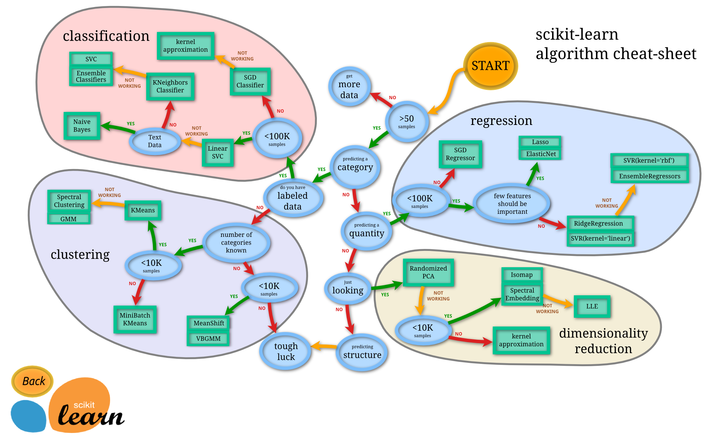
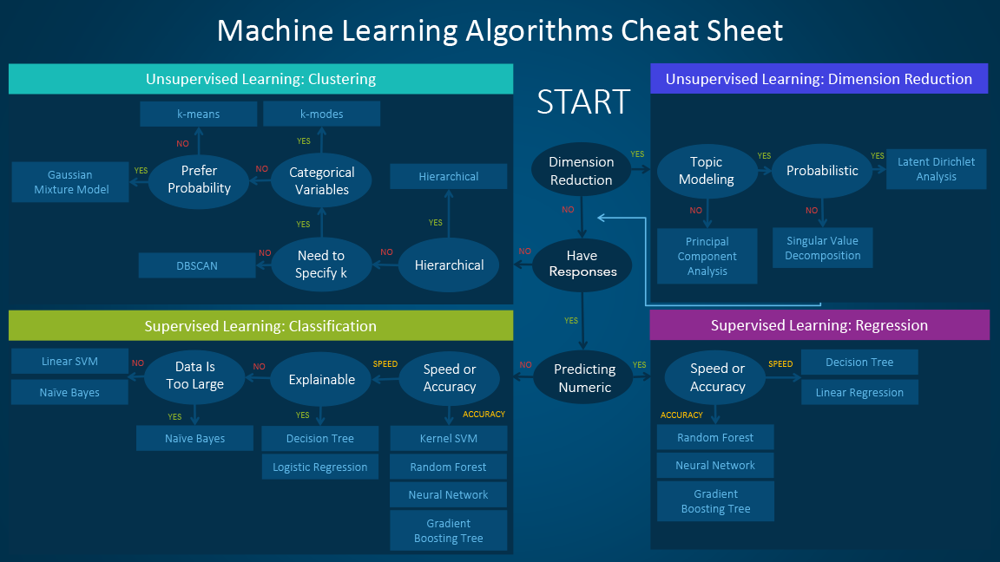

# 📚 ML Projects Portfolio

<div align="center">




</div>

This repository contains multiple machine learning projects demonstrating various ML techniques and applications across different domains. Each project follows clean code principles and incorporates comprehensive data analysis, feature engineering, and model evaluation.

## 📑 Table of Contents

- [🧠 Machine Learning Algorithm Reference](#-machine-learning-algorithm-reference)
- [📋 Projects Portfolio](#-projects-portfolio)
- [1️⃣ MediPredict: AI-Powered Patient Outcome Predictor](#1️⃣-medipredict-ai-powered-patient-outcome-predictor)
- [2️⃣ Students Grades Prediction](#2️⃣-students-grades-prediction)
- [3️⃣ Classifiers on Breast Cancer](#3️⃣-classifiers-on-breast-cancer)
- [4️⃣ Student Performance Analysis](#4️⃣-student-performance-analysis-study)
- [🛠️ Technologies & Tools](#️-technologies--tools)
- [🚀 Getting Started](#-getting-started)
- [📊 Project Structure](#-project-structure)
- [🎯 Learning Outcomes](#-learning-outcomes)
- [📝 Future Enhancements](#-future-enhancements)

## 🧠 Machine Learning Algorithm Reference

<div align="center">


*Machine Learning Algorithm Selection Guide*

</div>

---

<div align="center">



*Comprehensive Machine Learning Algorithms Overview*

</div>

---

## 📋 Projects Portfolio

<div align="center">

| Project | Domain | Algorithm Focus | Key Features |
|---------|--------|----------------|--------------|
| 🏥 **MediPredict** | Healthcare | Classification | Patient Outcome Prediction, Clinical Decision Support |
| 🎓 **Grade Predictor** | Education | Regression | Academic Performance, Student Analytics |
| 🩺 **Cancer Classifier** | Medical | Binary Classification | Tumor Classification, Medical Diagnostics |
| 📊 **Performance Study** | Education | Analysis | Statistical Analysis, Performance Factors |

</div>

## 1️⃣ MediPredict: AI-Powered Patient Outcome Predictor

**Project Idea Name:** MediPredict: AI-Powered Patient Outcome Predictor

**Objective:** Integrate machine learning into an Outpatient Clinics Management System to predict patient outcomes and enhance clinical decision-making through predictive analytics.

**Dataset:** 📊 [Healthcare Dataset - Kaggle](https://www.kaggle.com/datasets/prasad22/healthcare-dataset/data)

**Description:** 

MediPredict is an advanced healthcare AI solution that leverages machine learning to predict patient outcomes in outpatient clinical settings. This project uses a synthetic healthcare dataset to build predictive models that assist healthcare professionals in making data-driven decisions.

**Core Features:**

1. **Test Results Prediction (Primary Feature)**
   - Multi-class classification task predicting test results: "Normal," "Abnormal," or "Inconclusive"
   - Input features: Age, Gender, Medical Condition, Medication, Billing Amount, and other clinical parameters
   - Utilizes advanced ML algorithms to analyze patient data patterns
   - Provides confidence scores for each prediction to support clinical judgment

2. **Medical Condition Diagnosis (Extended Feature)**
   - Classification of various medical conditions including Diabetes, Hypertension, and other common outpatient diagnoses
   - Analyzes tabular patient data including demographics, medical history, and admission details
   - Pattern recognition across multiple patient attributes
   - Risk stratification for different conditions

**Dataset Features:**
- **Demographics:** Age, Gender, Location
- **Medical Information:** Medical Condition, Blood Type, Current Medications
- **Clinical Data:** Test Results, Diagnosis codes, Treatment history
- **Administrative Data:** Admission Type, Discharge Date, Billing Amount
- **Insurance Information:** Insurance Provider, Coverage details

**Machine Learning Approach:**
- **Data Preprocessing:** Handling missing values, encoding categorical variables, feature scaling
- **Feature Engineering:** Creating derived features from patient history and clinical parameters
- **Model Selection:** Testing multiple algorithms (Random Forest, XGBoost, Neural Networks, SVM)
- **Model Evaluation:** Cross-validation, confusion matrix, precision-recall analysis, ROC-AUC scores
- **Hyperparameter Tuning:** Grid search and random search for optimal model parameters

**Key Applications:**

1. **Clinical Decision Support:** Assist doctors in interpreting test results and identifying potential diagnoses
2. **Resource Optimization:** Predict patient outcomes to optimize resource allocation in outpatient clinics
3. **Early Warning System:** Identify patients at risk of adverse outcomes requiring immediate attention
4. **Quality Improvement:** Analyze patterns to improve clinical protocols and patient care standards
5. **Population Health Management:** Identify trends and risk factors across patient populations

**Technical Implementation:**
- Python-based machine learning pipeline
- Integration with healthcare management systems
- Real-time prediction capabilities
- Scalable architecture for handling large patient datasets
- Privacy-preserving design following healthcare data standards (HIPAA compliance considerations)

**Expected Outcomes:**
- Improved diagnostic accuracy through AI-assisted analysis
- Reduced time to treatment decisions
- Better patient outcomes through early intervention
- Enhanced operational efficiency in outpatient settings
- Data-driven insights for continuous care improvement

**Use Case Scenario:** 

A patient visits an outpatient clinic with specific symptoms. The healthcare provider enters the patient's demographic information, medical history, current medications, and preliminary test data into the MediPredict system. The AI model analyzes this information and:
1. Predicts the likelihood of test results being Normal, Abnormal, or Inconclusive
2. Suggests potential medical conditions that match the patient's profile
3. Provides risk scores for various diagnoses
4. Recommends follow-up tests or immediate interventions based on the predictions

This enables healthcare providers to make more informed decisions, prioritize high-risk patients, and deliver more personalized care.

---

## 🛠️ Technologies & Tools

<div align="center">

| Category | Technologies |
|----------|-------------|
| **Programming** |  |
| **Data Analysis** |   |
| **Machine Learning** |  |
| **Visualization** |   |
| **Development** |  |

</div>

---

## 2️⃣ Students Grades Prediction

**Objective:** Predict student academic performance based on various demographic, social, and school-related features.

**Description:** This project analyzes student data including age, parental education, family size, study time, and other factors to predict student grades (G1, G2, G3). The analysis includes:
- Exploratory Data Analysis (EDA) with visualizations
- Feature engineering and encoding categorical variables
- Data preprocessing and handling missing values
- Model training for grade prediction
- Performance evaluation and insights

**Dataset Features:**
- Demographics: age, sex, address, family size
- Educational background: parental education (Medu, Fedu), parental jobs (Mjob, Fjob)
- School-related: school, study time, failures, absences
- Social factors: family relationships, free time, going out, alcohol consumption
- Target variables: G1, G2, G3 (grades in three periods)

**Use Case:** Educational institutions can use this model to identify at-risk students early and provide targeted interventions to improve academic outcomes.

---

## 3️⃣ Classifiers on Breast Cancer

**Objective:** Classify breast cancer tumors as malignant or benign using various machine learning classification algorithms.

**Description:** This project implements multiple classification algorithms on the Breast Cancer Wisconsin (Diagnostic) dataset. The project demonstrates:
- Comprehensive comparison of different classification algorithms
- Feature analysis and correlation studies
- Model performance evaluation using multiple metrics
- Cross-validation and hyperparameter tuning
- Visualization of decision boundaries and model performance

**Dataset Features:**
- Features computed from digitized images of fine needle aspirate (FNA) of breast masses
- Characteristics include: radius, texture, perimeter, area, smoothness, compactness, concavity, symmetry, and fractal dimension
- Both mean values and worst-case values for each feature

**Use Case:** Medical professionals can utilize this model as a diagnostic support tool to assist in early detection and classification of breast cancer, potentially improving treatment outcomes.

---

## 4️⃣ Student Performance Analysis (Study)

**Objective:** Analyze and predict student performance based on comprehensive demographic and educational factors.

**Description:** This project focuses on analyzing student performance data from secondary education. It includes:
- Detailed exploratory data analysis
- Statistical analysis of factors affecting student performance
- Data preprocessing and feature engineering
- Model development for performance prediction

**Dataset Features:**
- Student demographics and background information
- Educational context and parental involvement
- Study habits and time management
- Social and lifestyle factors

**Use Case:** Schools and educational policymakers can leverage these insights to understand key factors influencing student success and develop evidence-based intervention strategies.

---

## 🚀 Getting Started

### Prerequisites
- Python 3.8 or higher
- Jupyter Notebook or JupyterLab

### Installation & Setup

1. **Clone the repository**
   ```bash
   git clone https://github.com/MMansy19/ML-Projects.git
   cd ML-Projects
   ```

2. **Install required dependencies**
   ```bash
   pip install pandas numpy scikit-learn matplotlib seaborn jupyter
   ```

3. **Launch Jupyter Notebook**
   ```bash
   jupyter notebook
   ```

4. **Navigate to any project directory and open the Code.ipynb file**

### Quick Start Guide

Each project is self-contained with:
- 📓 **Jupyter Notebook** - Complete analysis and code
- 📊 **Dataset** - Ready-to-use CSV files  
- 📝 **Documentation** - Inline comments and explanations
- 🔍 **Visualizations** - Data insights and model performance charts

> 💡 **Tip:** Run cells sequentially to reproduce the complete analysis!

---

## 📊 Project Structure

```
📁 ML-Projects/
├── 📄 README.md
├── 📁 assets/
│   ├── 🖼️ machine-learning-algorithm-cheat-sheet.png
│   ├── 🖼️ machine-learning-cheet-sheet-2.png
│   └── 🖼️ ml_map.png
├── 🏥 1) Patient Outcome Predictor/
│   └── 📊 healthcare_dataset.csv
├── 🎓 2) Students Grades Prediction/
│   ├── 📓 Code.ipynb
│   └── 📊 student_data.csv
├── 🩺 3) Classifiers on Breast Cancer/
│   ├── 📓 Code.ipynb
│   └── 📊 Breast_Cancer Dataset.csv
└── 📈 4) Student Performance Analysis/
    ├── 📓 Code.ipynb
    └── 📊 StudentsPerformance.csv
```

---

## 🎯 Learning Outcomes

<div align="center">

### Core Competencies Demonstrated

</div>

| Skill Category | Specific Skills |
|---------------|----------------|
| **🔍 Data Analysis** | Exploratory Data Analysis, Statistical Analysis, Data Visualization |
| **⚙️ Data Engineering** | Data Preprocessing, Feature Engineering, Missing Value Handling |
| **🤖 Machine Learning** | Model Selection, Algorithm Implementation, Hyperparameter Tuning |
| **📊 Model Evaluation** | Cross-validation, Performance Metrics, Model Comparison |
| **💻 Technical Skills** | Python Programming, Jupyter Notebooks, Version Control |
| **🎨 Visualization** | Matplotlib, Seaborn, Statistical Plots, Results Interpretation |
| **📝 Documentation** | Code Documentation, Project Documentation, Technical Writing |
| **🌍 Real-world Application** | Problem Definition, Solution Design, Domain Knowledge Integration |

### 🏆 Professional Skills Gained

- ✅ End-to-end machine learning pipeline development
- ✅ Cross-domain problem-solving (Healthcare, Education)
- ✅ Statistical analysis and hypothesis testing
- ✅ Clean code practices and best practices
- ✅ Technical communication and documentation
- ✅ Critical thinking and analytical reasoning

---

## 📝 Future Enhancements

- Implement deep learning models for complex pattern recognition
- Add real-time prediction APIs
- Develop interactive dashboards for model insights
- Expand to more diverse datasets and domains
- Implement ensemble methods for improved accuracy
- Add automated model retraining pipelines

---

## 👤 Author

<div align="center">

**Mohamed Mansy**

*Machine Learning Enthusiast | Data Science Student*

[](https://github.com/MMansy19)
[](https://linkedin.com/in/your-profile)

*Feel free to explore, learn, and contribute to these projects!*

</div>

---

## 📞 Contact & Collaboration

- 💬 **Questions?** Open an issue in this repository
- 🤝 **Collaborations?** Feel free to fork and submit pull requests
- 📧 **Connect:** Reach out via GitHub or LinkedIn

---

## 🙏 Acknowledgments

- Thanks to the open-source community for the amazing tools and libraries
- Special appreciation for the datasets used in these projects
- Inspired by real-world applications of machine learning in various domains

---

## 📄 License

This repository is for educational purposes and personal learning.
